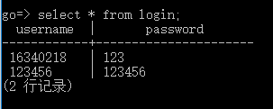

# 使用Docker部署Go应用

实验人：周伟标

## 1.实验要求

将go开发的web应用容器化

**任务目标**

1. 使用单台服务器，使用docker部署go web应用
2. 掌握docker的简单操作
3. 学会使用dockerfile构建服务容器
4. 学会使用docker-compose部署应用

## 2.实验过程

###docker下载与安装

> 参照[博客](https://www.cnblogs.com/stulzq/p/7743073.html)在centos7环境下安装

安装前置包：

`sudo yum install -y yum-utils device-mapper-persistent-data lvm2`

设置稳定存储库：

`sudo yum-config-manager --add-repo https://download.docker.com/linux/centos/docker-ce.repo`

启用test和edge：

`sudo yum-config-manager --enable docker-ce-edge`

`sudo yum-config-manager --enable docker-ce-test`

安装docker CE

`sudo yum install docker-ce`

启动docker

`sudo systemctl start docker`

通过Hello-world镜像来验证docker是否安装成功：

`sudo docker run hello-world`

### dockerfile编写

**dockerfile常用命令**

1. `FROM`:FROM 镜像指令指明了当前镜像继承的基镜像，编译当前镜像时会自动下载基镜像 ,如果不指定映像url 则从docker hub 上获取。 e.g ： FROM ubuntu 
2. `MAINTAINER `:MAINTAINER 指令 指定了当前镜像的作者及联系方式。e.g ： MAINTAINER: caiqiufang
3. `RUN`:RUN 指令可以在当前镜像上执行Linux  命令并形成一个新的层，RUN 是编译时（build） 的动作，在docker 命令中运行的shell 命令,等价于docker run <image> <command> 示例可以是如下两种,CMD 和 ENTRYPOINT也是如此 e.g ： RUN /bin/bash -c "echo helloworld"    or   RUN {"/bin/bash", "-c" ,"echo helloworld"}
4. `CMD`:CMD 指令指明了启动镜像容器时的默认行为(docker 容器运行时的默认命令)，一个Dockerfile 里只有一个CMD 指令，CMD 指令里设定的命令可以在运行镜像时使用参数覆盖，CMD 是 运行时（run）的动作。 e.g ：  CMD echo "this is a test"  正如上所说可以被运行时的参数覆盖，如下： docker  run -d imag_name echo "this is not a test"
5. `EXPOSE`:指明了镜像运行时的容器必须监听的端口  e.g : EXPOSE 8080
6. `ENV`:用来设置环境变量  e.g :  ENV myname = caiqiufang   or ENV myname  caiqiufang
7. `ADD`: ADD 指令是指从当前工作目录复制文件到镜像目录中去 e.g ： ADD test.txt   /mydir/
8. `ENTRYPOINT `:ENTRYPOINT 指令可以让容器像一个可执行程序一样运行，这样镜像运行时可以像软件一样 接收参数执行。ENTRYPOINT 是运行（run）时的动作  e.g : ENTRYPOINT {"/bin/echo"}  ,那么我们可以向镜像传递参数运行 docker run  -d image_name  "this is a test"
9. `WORKDIR <path>`:指定RUN, CMD, ENTRYPOINT  等命令运行的工作路径 

**编写dockerfile**


解释如下：

1. 基镜像：`golang:latest`
2. 工作路径：`/go/src/apiongo`
3. 运行命令：`go get ` `go build` `go build -o main .`
4. 默认运行：`/go/src/apiongo/main`

**docker运行截图**


**项目测试**

docker运行后， 打开`log.html`


登录已注册用户后，跳转到主页：


选择想要filter的内容，并输入id号进行查询：


稍等片刻后，页面返回查询信息：


### 数据库实现

首先作业目标有，在使用上一次作业的基础上，将数据库改为mysql

由于官方不提供实现，所以要先下载第三方的实现

这里有我在网上找到的各种实现方法：
[golang连接数据库实现方法](https://github.com/golang/go/wiki/SQLDrivers)

由于未使用过mysql，所以我们选择使用相似的postgresql

那么我们就要找到合适的工具，帮助我们用go语言进行连接和操作数据库

#### 安装依赖包

首先是连接postgresql数据库用的包

`go get github.com/lib/pq`

然后是框架需要用到的包

`go get github.com/go-sql-driver/mysql`

导入文件的时候需要再加一个database/sql，然后上面装的两个包需要添加下划线：

```
import (
	"database/sql"
	_ "github.com/go-sql-driver/mysql"
	_ "github.com/lib/pq"
	"fmt"
	"html/template"
	"log"
	"net/http"
	"strings"
 
	//"reflect"
	"723ApiOnGo/723swapi/swapi"
	//"github.com/boltdb/bolt"
	"strconv"
	
)

```

#### 创建数据库

首先在postgresql中创建一个新的用户，或者直接使用root用户，然后创建一个新的数据库，用于golang连接。注意，创建新用户后，记得赋予权限。

```shell
CREATE USER wangkuo1 WITH PASSWORD '123456';  
CREATE DATABASE go OWNER wangkuo1;  
GRANT ALL PRIVILEGES ON DATABASE go TO wangkuo1;  

```

#### go语言连接数据库

代码如下：

```go
psqlInfo := fmt.Sprintf("host=localhost port=5432 user=wangkuo1 "+
        "password=123456 dbname=go sslmode=disable")
    db, err := sql.Open("postgres", psqlInfo)
	if err != nil {
        fmt.Println(err);
        return
    }

```


#### 操作数据库

##### 插入数据

```go
stmt,err:=db.Prepare("INSERT INTO login(username,password) VALUES ($1,$2)")
	if err != nil {
        fmt.Println(err);
    }
	stmt.Exec(username[0],password[0])

```

结果如图



##### 查询数据

```go
sqlStatement := "SELECT password FROM login WHERE username=$1;"
    var v []byte
    row := db.QueryRow(sqlStatement, username[0])
    err = row.Scan(&v)
    switch err {
    case sql.ErrNoRows:
        //没有找到结果，在此输入的你响应过程
    case nil:
    	//成功查询到结果，在此输入你的响应过程
    default:
        panic(err)
    }

```

除了`QueryRow`之外，也可以使用`Query`的方法
但是这里因为用户名`username`是唯一的，因此只能查找到一行数据，Query是当有可能返回多个数据时使用的。
