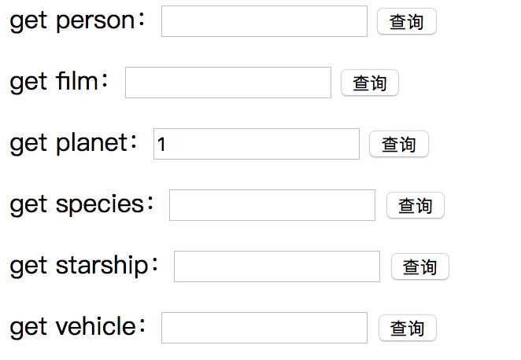
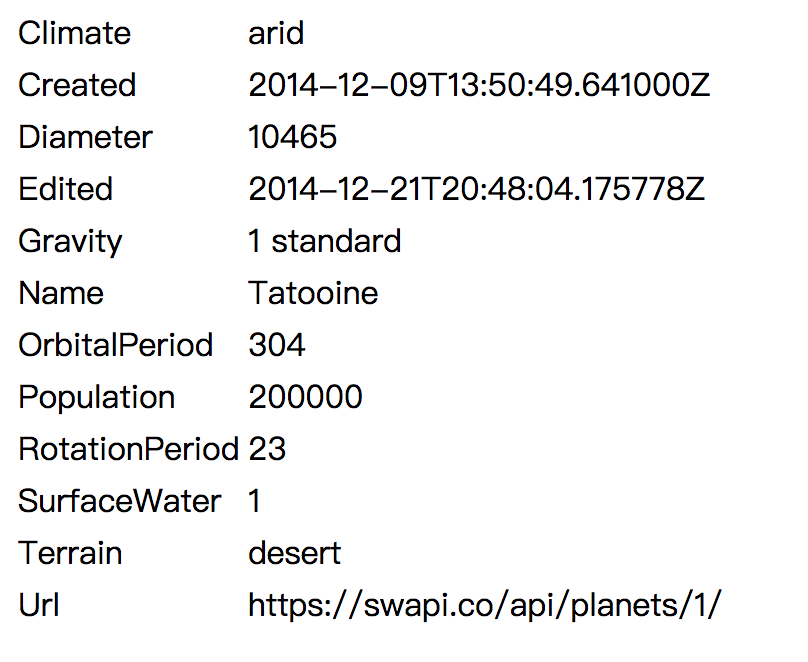

# 应用容器化

实验人：周伟标 韩承希 陈咏强


## 实验要求

将上一次作业go语言开发的web应用容器化

**任务目标**

1. 使用单台服务器，使用docker部署go web应用
2. 掌握docker的简单操作
3. 学会使用dockerfile构建服务容器
4. 学会使用docker-compose部署应用

## 实验过程

### docker安装过程

安装前置包：

`sudo yum install -y yum-utils device-mapper-persistent-data lvm2`

设置稳定存储库：

`sudo yum-config-manager --add-repo https://download.docker.com/linux/centos/docker-ce.repo`

启用edge和test：

`sudo yum-config-manager --enable docker-ce-edge`

`sudo yum-config-manager --enable docker-ce-test`

安装docker CE

`sudo yum install docker-ce`

启动docker

`sudo systemctl start docker`

通过Hello-world镜像来验证docker是否安装成功：

`sudo docker run hello-world`

### dockerfile编写

```
FROM golang:latest

WORKDIR /go/src/apiongo
COPY . /go/src/apiongo
RUN go get && go build
RUN go build -o main .
CMD ["/go/src/apiongo/main"]

```

解释如下：

1. 基镜像：`golang:latest`
2. 工作路径：`/go/src/apiongo`
3. 运行命令：`go get ` `go build` `go build -o main .`
4. 默认运行：`/go/src/apiongo/main`

**docker运行截图**

启动docker
```
$ docker build -t apiongo .
Sending build context to Docker daemon 2. 518MB
Step 1/6: FROM golang:latest
 ---> 2422e4d43e15
Step 2/6: WORKDIR/go/src/apiongo
 ---> Using cache
 ---> 4c6def834162
Step 3/6: COPY./go/src/apiongo
 ---> e18f83cd8159
Step 4/6: RUN go get & go build
 ---> Running in 6ed96c9b0106
Removing intermediate container 6ed96c9b0106
 ---> 605a4daad943
Step 5/6: RUN go build-o main .
 ---> Running in e88b53c55367
Removing intermediate container e88b53c55367
 ---> 5ca4a881b2ed
Step 6/6: CMD [/go/src/apiongo/main"]
 ---> Running in 89e638e55b6c
Removing intermediate container 89e638e55b6c
 ---> 5055e2fdd3e
Successfully built 5055e2fded3e
Successfully tagged apiongo: latest
```

```
$ docker run -p 9090:9090 -name="test" -d apiongo
3c75cfd7f7346153037a4bfdb56c42ec3c9e3d25d7175e960e38f1e89f18e876
```


**项目测试**

docker运行后， 打开`log.html`


登录已注册用户后，跳转到主页：


选择想要filter的内容，并输入id号进行查询：



稍等片刻后，页面返回查询信息：




### 数据库实现

在使用上一次作业的基础上，将数据库改为mysql

由于未使用过mysql，所以我们选择使用相似的postgresql

接下来找到合适的工具，帮助我们用go语言进行连接和操作数据库

#### 安装依赖包

首先是连接postgresql数据库用的包

`go get github.com/lib/pq`

然后是框架需要用到的包

`go get github.com/go-sql-driver/mysql`

导入包时还需要再加一个database/sql

```
import (
	"database/sql"
	_ "github.com/go-sql-driver/mysql"
	_ "github.com/lib/pq"
	"fmt"
	"html/template"
	"log"
	"net/http"
	"strings"
 
	//"reflect"
	"ApiOnGo/swapi/swapi"
	//"github.com/boltdb/bolt"
	"strconv"
	
)

```

#### 创建数据库

首先在postgresql中创建一个新的用户，或者直接使用root用户，然后创建一个新的数据库，用于golang连接。注意，创建新用户后，记得赋予权限。

```shell
CREATE USER wangkuo1 WITH PASSWORD '123456';  
CREATE DATABASE go OWNER sysu;  
GRANT ALL PRIVILEGES ON DATABASE go TO wangkuo1;  

```

#### go语言连接数据库

代码如下：

```go
psqlInfo := fmt.Sprintf("host=localhost port=5432 user=sysu "+
        "password=123456 dbname=go sslmode=disable")
    db, err := sql.Open("postgres", psqlInfo)
	if err != nil {
        fmt.Println(err);
        return
    }

```


#### 操作数据库

##### 插入数据

```go
stmt,err:=db.Prepare("INSERT INTO login(username,password) VALUES ($1,$2)")
	if err != nil {
        fmt.Println(err);
    }
	stmt.Exec(username[0],password[0])

```

结果如图


##### 查询数据

```go
sqlStatement := "SELECT password FROM login WHERE username=$1;"
    var v []byte
    row := db.QueryRow(sqlStatement, username[0])
    err = row.Scan(&v)
    switch err {
    case sql.ErrNoRows:
        //没有找到结果，在此输入的你响应过程
    case nil:
    	//成功查询到结果，在此输入你的响应过程
    default:
        panic(err)
    }

```

